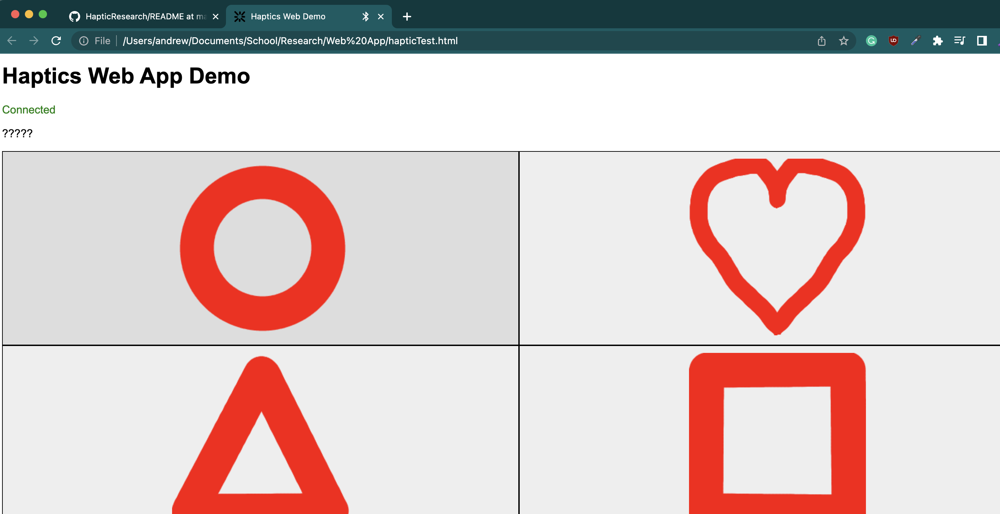

The web app is utilizing Chrome's Bluetooth Low Energy functionality. This should work with the Chrome browser on all devices except IOS.
https://developer.chrome.com/articles/bluetooth/ 

5/12/2023:
This web app currently does not fully work; there is some sort-of bug related to data transmission. I am working on fixing this.

Helpful Links and References:
- https://beaufortfrancois.github.io/sandbox/web-bluetooth/generator/
- https://randomnerdtutorials.com/esp32-bluetooth-low-energy-ble-arduino-ide/
- https://randomnerdtutorials.com/esp32-ble-server-client/
- https://reference.arduino.cc/reference/en/libraries/arduinoble/
- https://stackoverflow.com/questions/40711300/javascript-do-something-every-n-seconds
